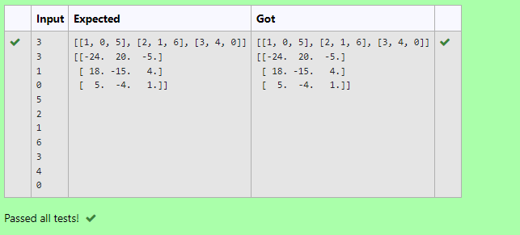

# Inverse-of-matrix

## AIM:
To write a python program to find inverse a matrix.

## ALGORITHM:

### Step 1:
Start python program.

### Step 2:
Import numpy.Create two null lists.

### Step 3:
Get the parameters and the elements from the user using for loops.

### Step 4:
Inverse the matrix using linalg library.

### Step 5:
End the program.

## PROGRAM:

~~~
import numpy as np
l1,l2=[],[]
n1,n2=int(input()),int(input())
for i in range (n1):
    for j in range (n2):
        values=int(input())
        l1.append(values)
    l2.append(l1)
    l1=[]
print(l2)
matrix=np.array(l2)
inverse=np.linalg.inv(matrix)
print(inverse)

~~~

## OUTPUT:

## RESULT:
A python program to find inverse a matrix has been created successfully.